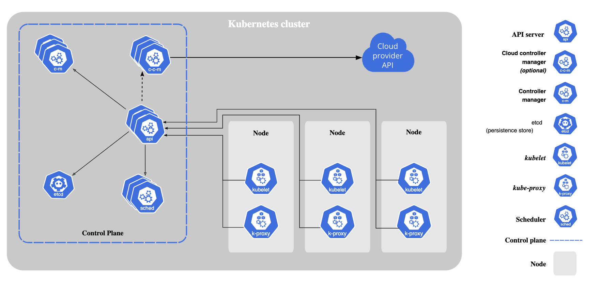

# Overview

## Offical Definition of Kubernetes

Kubernetes is a portable, extensible, open source platform for managing containerized workloads and services, that facilitates both declarative configuration and automation.

For more [details](https://kubernetes.io/docs/concepts/overview/).

## What it can do?

- Service discovery and load balancing
- Storage orchestration
- Automated rollouts and rollbacks
- Automatic bin packing
- Self-healing
- Secret and configuration management
- Batch execution
- Horizontal scaling
- IPv4/IPv6 dual-stack
- Designed for extensibility

## Kubernetes Architecture and Components

When you deploy Kubernetes, you get a cluster.

A Kubernetes cluster consists of a set of worker machines, called nodes, that run containerized applications. Every cluster has at least one worker node.

The worker node(s) host the Pods that are the components of the application workload. The control plane manages the worker nodes and the Pods in the cluster. Fore more [details](https://kubernetes.io/docs/concepts/overview/components/).

## Control Plane Components 

**kube-apiserver**
The API server is a component of the Kubernetes control plane that exposes the Kubernetes API. The API server is the front end for the Kubernetes control plane.

**etcd**
Consistent and highly-available key value store used as Kubernetes' backing store for all cluster data.

**kube-scheduler**
Control plane component that watches for newly created Pods with no assigned node, and selects a node for them to run on.

**kube-controller-manager**
Control plane component that runs controller processes.

Node controller: Responsible for noticing and responding when nodes go down.
Job controller: Watches for Job objects that represent one-off tasks, then creates Pods to run those tasks to completion.
EndpointSlice controller: Populates EndpointSlice objects (to provide a link between Services and Pods).

**cloud-controller-manager**
A Kubernetes control plane component that embeds cloud-specific control logic. The cloud controller manager lets you link your cluster into your cloud provider's API, and separates out the components that interact with that cloud platform from components that only interact with your cluster.

Node controller: For checking the cloud provider to determine if a node has been deleted in the cloud after it stops responding
Route controller: For setting up routes in the underlying cloud infrastructure
Service controller: For creating, updating and deleting cloud provider load balancers

## Node Components

**kubelet**
An agent that runs on each node in the cluster. It makes sure that containers are running in a Pod.

**kube-proxy**
kube-proxy is a network proxy that runs on each node in your cluster, implementing part of the Kubernetes Service concept.

kube-proxy maintains network rules on nodes. These network rules allow network communication to your Pods from network sessions inside or outside of your cluster.

**Container runtime**
A fundamental component that empowers Kubernetes to run containers effectively.

