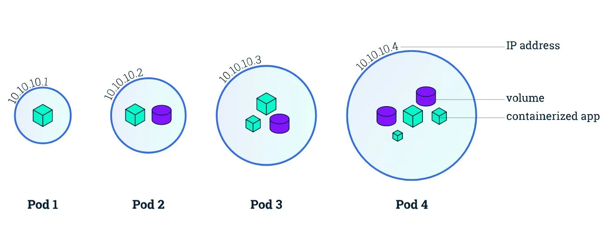
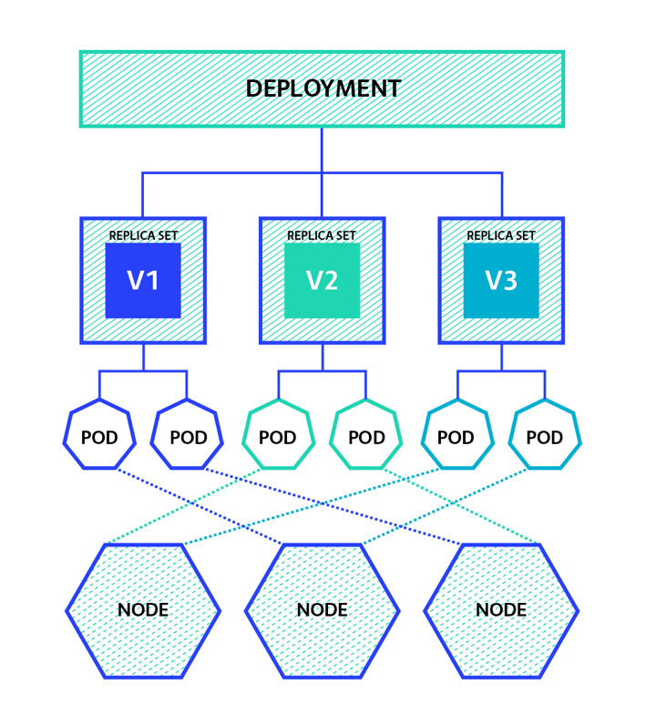

### Pod

Pods are the smallest deployable units of computing that you can create and manage in Kubernetes.
It is a group of one or more containers, with shared storage and network resources, and a specification for how to run the containers.


#### Few Points about Pods
- Pods are ephimeral and disposable entities
- Pods are immutable in nature. 
- Pod has its own IP address. Containers Inside a pod share the same network and IP. 
- Usually we don't create pods directly, we create them using workload resources like Deployments or job. If the pods require to have a statefullness, consider using Statefulset resource.
- Each pod is meant to run single instance of a given application.



#### Phases of Pod
- Pending
- Running
- Succeeded
- Failed
- Unknown

#### Create a Pod

**Example**

Creating via kubectl

```shell
kubectl run sleeping-pod --image=busybox --restart=Never --command -- sleep 5
```

**Example**

Basic pod template

```yml
apiVersion: v1
kind: Pod
metadata:
  name: mypod
spec:
  containers:
  - name: mycontainer
    image: nginx
```

**Example**

Adding Environment Variable

```yml
apiVersion: v1
kind: Pod
metadata:
  name: mypod
spec:
  containers:
  - name: mycontainer
    image: nginx
    env:
    - name: MY_VAR
      value: "hello"
```

**Example**

Providing resource contraints
```yml
apiVersion: v1
kind: Pod
metadata:
  name: mypod
spec:
  containers:
  - name: mycontainer
    image: nginx
    resources:
      limits:
        cpu: "0.5"
        memory: "512Mi"
      requests:
        cpu: "0.25"
        memory: "256Mi"
```

[Read more on Pods](https://kubernetes.io/docs/concepts/workloads/pods/)

### Deployments

A Deployment provides declarative updates for Pods and ReplicaSets.



#### Use Cases
- Declare the new state of the Pods
- Rollback to an earlier deployment revision
- Scale up the deployment to facilitate more load
- Pause the rollout of a deployment
- Create a deployment to rollout a replicaset
- Use the status of the deployment
- Clean up older ReplicaSets

**Example**

**Initial Deployment**

```yml
apiVersion: apps/v1
kind: Deployment
metadata:
  name: mydeployment
spec:
  replicas: 3
  selector:
    matchLabels:
      app: myapp
  template:
    metadata:
      labels:
        app: myapp
    spec:
      containers:
      - name: mycontainer
        image: nginx
        ports:
        - containerPort: 80

```

**Adding Environment Variables**

```yml
apiVersion: apps/v1
kind: Deployment
metadata:
  name: mydeployment
spec:
  replicas: 3
  selector:
    matchLabels:
      app: myapp
  template:
    metadata:
      labels:
        app: myapp
    spec:
      containers:
      - name: mycontainer
        image: nginx
        ports:
        - containerPort: 80
        env:
        - name: MY_VAR
          value: "hello"

```

#### Create a Deployment
```bash
kubectl apply -f configs/deployment.yaml
```

#### Get the Deployments
```bash
kubectl get deployments
```

#### See the Deployment Rollout status
```bash
kubectl rollout status deployment/nginx-deployment
```

#### Delete the Deployments
```bash
kubectl delete -f configs/deployment.yaml
```
