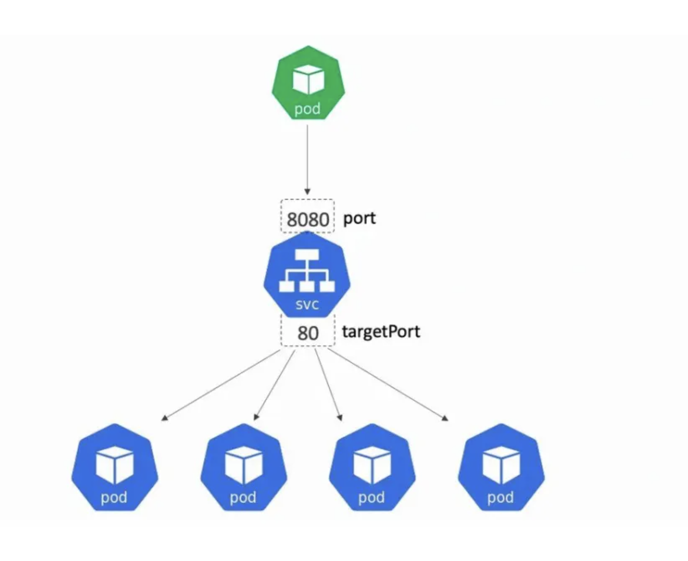

## Kubernetes Network Model

- Every pod gets a unique cluster-wide ip address
- pods can communicate with all other pods on any other node without NAT
- agents on a node (e.g. system daemons, kubelet) can communicate with all pods on that node
- Kubernetes IP addresses exist at the Pod scope
  - containers within a Pod share their network namespaces - including their IP address and MAC address.
  - This means that containers within a Pod can all reach each other's ports on localhost.
- DNS:
  - Pod DNS: `<pod-ip>.<name-space>.pod.<cluster-domain>` eg: `10-244-0-21.default.pod.cluster.local`
  - Service DNS `<service-name>.<name-space>.pod.<cluster-domain>` eg: `kubernetes.default.svc.cluster.local`

## Kubernets IP Address Ranges

- Kubernetes clusters require to allocate non-overlapping IP addresses for Pods, Services and Nodes.
- The network plugin is configured to assign IP addresses to Pods.
- The kube-apiserver is configured to assign IP addresses to Services.
- The kubelet or the cloud-controller-manager is configured to assign IP addresses to Nodes.

## Service

In Kubernetes, a Service is a method for exposing a network application that is running as one or more Pods in your cluster. 

- When Kubernetes starts a container, it provides environment variables pointing to all the Services which were running when the container was started.
- The DNS server watches the Kubernetes API for new Services and creates a set of DNS records for each.
- Use headless Services (which have a ClusterIP of None) for service discovery when you don't need kube-proxy load balancing.



### Service Demo
Deploy nginx config
```shell
kubectl apply -f configs/config.yaml
```

Deploy pods
```shell
~> kubectl apply -f configs/deployment.yaml 
deployment.apps/nginx created

~> kubectl get deployments.apps 
NAME    READY   UP-TO-DATE   AVAILABLE   AGE
nginx   3/3     3            3           15s

~> k get pods -o wide -l=app=nginx
NAME                    READY   STATUS    RESTARTS   AGE   IP            NODE                     NOMINATED NODE   READINESS GATES
nginx-5f5c47659-4qpbd   1/1     Running   0          93s   10.244.0.27   k8s-labs-control-plane   <none>           <none>
nginx-5f5c47659-66854   1/1     Running   0          91s   10.244.0.28   k8s-labs-control-plane   <none>           <none>
nginx-5f5c47659-lbb4m   1/1     Running   0          90s   10.244.0.29   k8s-labs-control-plane   <none>           <none>
```

Deploy network utility pods and run the connectivity check commands
```shell
~> kubectl run utility -it --image=busybox -- /bin/sh

/ # wget -qO- --server-response 10.244.0.27
  HTTP/1.1 200 OK
  Server: nginx/1.14.2
  Date: Thu, 23 May 2024 04:33:03 GMT
  Content-Type: text/html
  Content-Length: 612
  Last-Modified: Tue, 04 Dec 2018 14:44:49 GMT
  Connection: close
  ETag: "5c0692e1-264"
  Pod-Name: nginx-5f5c47659-4qpbd
  Accept-Ranges: bytes
  
<!DOCTYPE html>
<html>
<head>
<title>Welcome to nginx!</title>
<style>
    body {
        width: 35em;
        margin: 0 auto;
        font-family: Tahoma, Verdana, Arial, sans-serif;
    }
</style>
</head>
<body>
<h1>Welcome to nginx!</h1>
<p>If you see this page, the nginx web server is successfully installed and
working. Further configuration is required.</p>

<p>For online documentation and support please refer to
<a href="http://nginx.org/">nginx.org</a>.<br/>
Commercial support is available at
<a href="http://nginx.com/">nginx.com</a>.</p>

<p><em>Thank you for using nginx.</em></p>
</body>
</html>
/ # wget -qO- --server-response 10-244-0-27.default.pod.cluster.local
  HTTP/1.1 200 OK
  Server: nginx/1.14.2
  Date: Thu, 23 May 2024 04:34:08 GMT
  Content-Type: text/html
  Content-Length: 612
  Last-Modified: Tue, 04 Dec 2018 14:44:49 GMT
  Connection: close
  ETag: "5c0692e1-264"
  Pod-Name: nginx-5f5c47659-4qpbd
  Accept-Ranges: bytes
  
<!DOCTYPE html>
<html>
<head>
<title>Welcome to nginx!</title>
<style>
    body {
        width: 35em;
        margin: 0 auto;
        font-family: Tahoma, Verdana, Arial, sans-serif;
    }
</style>
</head>
<body>
<h1>Welcome to nginx!</h1>
<p>If you see this page, the nginx web server is successfully installed and
working. Further configuration is required.</p>

<p>For online documentation and support please refer to
<a href="http://nginx.org/">nginx.org</a>.<br/>
Commercial support is available at
<a href="http://nginx.com/">nginx.com</a>.</p>

<p><em>Thank you for using nginx.</em></p>
</body>
</html>
```

Create Service

```shell
~> kubectl apply -f configs/cluster-service.yaml
service/nginx created

~> kubectl get svc -o wide
NAME         TYPE        CLUSTER-IP     EXTERNAL-IP   PORT(S)   AGE   SELECTOR
kubernetes   ClusterIP   10.96.0.1      <none>        443/TCP   92m   <none>
nginx        ClusterIP   10.96.218.89   <none>        80/TCP    81s   app=nginx
```

Send Requests using the service

```shell
/ # wget -qO- --server-response http://nginx
  HTTP/1.1 200 OK
  Server: nginx/1.14.2
  Date: Thu, 23 May 2024 04:36:29 GMT
  Content-Type: text/html
  Content-Length: 612
  Last-Modified: Tue, 04 Dec 2018 14:44:49 GMT
  Connection: close
  ETag: "5c0692e1-264"
  Pod-Name: nginx-5f5c47659-4qpbd
  Accept-Ranges: bytes
  
<!DOCTYPE html>
<html>
<head>
<title>Welcome to nginx!</title>
<style>
    body {
        width: 35em;
        margin: 0 auto;
        font-family: Tahoma, Verdana, Arial, sans-serif;
    }
</style>
</head>
<body>
<h1>Welcome to nginx!</h1>
<p>If you see this page, the nginx web server is successfully installed and
working. Further configuration is required.</p>

<p>For online documentation and support please refer to
<a href="http://nginx.org/">nginx.org</a>.<br/>
Commercial support is available at
<a href="http://nginx.com/">nginx.com</a>.</p>

<p><em>Thank you for using nginx.</em></p>
</body>
</html>
/ # wget -qO- --server-response http://10.96.218.89 #Try This OR

/ # wget -qO- --server-response http://nginx.default.svc.cluster.local #Try this, it should also work
```
### Service Types

- Cluster IP(default): service will only be accessible inside the cluster, via the cluster IP.
  - You can specify your own cluster IP address as part of a Service creation request. To do this, set the .spec.clusterIP field.
- NodePort: Service will be exposed on one port of every node, in addition to 'ClusterIP' type.
  - Kubernetes control plane allocates a port from a range specified by --service-node-port-range flag (default: 30000-32767).
  - Each node proxies that port (the same port number on every Node) into your Service.
- LoadBalancer: Service will be exposed via an external loadbalancer (if the cloud provider supports it), in addition to 'NodePort' type.
- ExternalName: Service consists of only a reference to an external name that kubedns or equivalent will return as a CNAME record.

**Cluster IP**
Default type is cluster Ip and is already created in above examples.

**NodePort Service**

```shell
~> kubectl apply -f configs/nodeport-service.yaml
service/nodeport-nginx created

~> kubectl get svc -o wide
NAME             TYPE        CLUSTER-IP      EXTERNAL-IP   PORT(S)        AGE    SELECTOR
kubernetes       ClusterIP   10.96.0.1       <none>        443/TCP        151m   <none>
nginx            ClusterIP   10.96.218.89    <none>        80/TCP         60m    app=nginx
nodeport-nginx   NodePort    10.96.195.172   <none>        80:30187/TCP   93s    app=nginx

## Accessing from the Worker/ControlPlane Node
~> docker exec k8s-labs-control-plane curl localhost:30187
  % Total    % Received % Xferd  Average Speed   Time    Time     Time  Current
                                 Dload  Upload   Total   Spent    Left  Speed
100   612  100   612    0     0  1147k      0 --:--:-- --:--:-- --:--:--  597k
<!DOCTYPE html>
<html>
<head>
<title>Welcome to nginx!</title>
<style>
    body {
        width: 35em;
        margin: 0 auto;
        font-family: Tahoma, Verdana, Arial, sans-serif;
    }
</style>
</head>
<body>
<h1>Welcome to nginx!</h1>
<p>If you see this page, the nginx web server is successfully installed and
working. Further configuration is required.</p>

<p>For online documentation and support please refer to
<a href="http://nginx.org/">nginx.org</a>.<br/>
Commercial support is available at
<a href="http://nginx.com/">nginx.com</a>.</p>

<p><em>Thank you for using nginx.</em></p>
</body>
</html>
```

**Loadbalancer Service**

```shell
~> kubectl apply -f configs/loadbalancer-service.yaml 
service/lb-nginx created

~> kubectl get svc -o wide
kubectl get svc -o wide
NAME             TYPE           CLUSTER-IP      EXTERNAL-IP   PORT(S)        AGE     SELECTOR
kubernetes       ClusterIP      10.96.0.1       <none>        443/TCP        154m    <none>
lb-nginx         LoadBalancer   10.96.154.141   <pending>     80:31082/TCP   25s     app=nginx
nginx            ClusterIP      10.96.218.89    <none>        80/TCP         63m     app=nginx
nodeport-nginx   NodePort       10.96.195.172   <none>        80:30187/TCP   4m41s   app=nginx
```

ExternalName service

```shell
~> kubectl apply -f configs/externalname-service.yaml 
service/ext-service created

~> kubectl get svc -o wide
NAME             TYPE           CLUSTER-IP      EXTERNAL-IP       PORT(S)        AGE     SELECTOR
ext-service      ExternalName   <none>          httpforever.com   <none>         24s     <none>
kubernetes       ClusterIP      10.96.0.1       <none>            443/TCP        156m    <none>
lb-nginx         LoadBalancer   10.96.154.141   <pending>         80:31082/TCP   90s     app=nginx
nginx            ClusterIP      10.96.218.89    <none>            80/TCP         64m     app=nginx
nodeport-nginx   NodePort       10.96.195.172   <none>            80:30187/TCP   5m46s   app=nginx

~> kubectl run curl --image=appropriate/curl --restart=Never -- curl -sI http://ext-service
pod/curl created

~> kubectl logs curl
HTTP/1.1 200 OK
Server: nginx/1.18.0 (Ubuntu)
Date: Thu, 23 May 2024 06:02:26 GMT
Content-Type: text/html
Content-Length: 5124
Last-Modified: Wed, 22 Mar 2023 14:54:48 GMT
Connection: keep-alive
ETag: "641b16b8-1404"
Referrer-Policy: strict-origin-when-cross-origin
X-Content-Type-Options: nosniff
Feature-Policy: accelerometer 'none'; camera 'none'; geolocation 'none'; gyroscope 'none'; magnetometer 'none'; microphone 'none'; payment 'none'; usb 'none'
Content-Security-Policy: default-src 'self'; script-src cdnjs.cloudflare.com 'self'; style-src cdnjs.cloudflare.com 'self' fonts.googleapis.com 'unsafe-inline'; font-src fonts.googleapis.com fonts.gstatic.com cdnjs.cloudflare.com; frame-ancestors 'none'; report-uri https://scotthelme.report-uri.com/r/d/csp/enforce
Accept-Ranges: bytes

~> kubectl delete pod curl
```

**Headless service**

Headless service is special type of ClusterIp service. A headless service refers to a Service resource that does not have a cluster IP address assigned. To define a headless service, we set the spec.clusterIP field to None in its resource definition. 

When we resolve the domain name of a typical service, the DNS returns a single IP address, which is the cluster IP of the service assigned by the control plane. However, a DNS query of a headless service’s name returns a list of IP addresses that belong to the backing pods.

This capability allows certain use cases that are not possible with normal services. For example, a monitoring service can use a headless service to find out the IP addresses of all the pods to send health check requests. With a regular service, there’s no guarantee as to which backing pod will receive the request.

Deploying headless-service
```shell
~> kubectl apply -f configs/headless-service.yaml
service/headless-nginx created
statefulset.apps/nginx created

~> kubectl get pods -l=app=stateful-nginx -o wide
NAME      READY   STATUS    RESTARTS   AGE     IP            NODE                     NOMINATED NODE   READINESS GATES
nginx-0   1/1     Running   0          3m22s   10.244.0.74   k8s-labs-control-plane   <none>           <none>
nginx-1   1/1     Running   0          3m18s   10.244.0.75   k8s-labs-control-plane   <none>           <none>
nginx-2   1/1     Running   0          3m15s   10.244.0.76   k8s-labs-control-plane   <none>           <none>

~> kubectl get svc
NAME             TYPE        CLUSTER-IP      EXTERNAL-IP   PORT(S)        AGE
headless-nginx   ClusterIP   None            <none>        80/TCP         4m22s

~> kubectl run utility --image=busybox --restart=Never -- /bin/sh

## Look at the response of the nslookup. It is responding with 3 ip addresses unlike default cluster ip service where it returns single service IP address.
/ # nslookup headless-nginx
Server:         10.96.0.10
Address:        10.96.0.10:53

** server can't find headless-nginx.cluster.local: NXDOMAIN

** server can't find headless-nginx.svc.cluster.local: NXDOMAIN

** server can't find headless-nginx.cluster.local: NXDOMAIN

** server can't find headless-nginx.svc.cluster.local: NXDOMAIN

Name:   headless-nginx.default.svc.cluster.local
Address: 10.244.0.74
Name:   headless-nginx.default.svc.cluster.local
Address: 10.244.0.75
Name:   headless-nginx.default.svc.cluster.local
Address: 10.244.0.76

# Headless service when used in combination with stateful sets can be used to give subdomain to the pods
/ # nslookup nginx-0.headless-nginx.default.svc.cluster.local
Server:         10.96.0.10
Address:        10.96.0.10:53


Name:   nginx-0.headless-nginx.default.svc.cluster.local
Address: 10.244.0.74
```


# Ingress [details](https://kubernetes.io/docs/concepts/services-networking/ingress/)

Make your HTTP (or HTTPS) network service available using a protocol-aware configuration mechanism, that understands web concepts like URIs, hostnames, paths, and more. The Ingress concept lets you map traffic to different backends based on rules you define via the Kubernetes API. 

Ingress Setup: https://kind.sigs.k8s.io/docs/user/ingress/

Deploy Nginx Ingress Controller

```shell

## add the ingress=true label to the node
kubectl label nodes k8s-labs-control-plane ingress-ready=true

## deploy the nginx ingress controller
kubectl apply -f https://raw.githubusercontent.com/kubernetes/ingress-nginx/main/deploy/static/provider/kind/deploy.yaml

## wait for it to get stable
kubectl wait --namespace ingress-nginx \
  --for=condition=ready pod \
  --selector=app.kubernetes.io/component=controller \
  --timeout=90s

```

Deploy Ingress Resource

```shell
#deploy nginx pods
kubectl apply -f configs/deployment.yaml

#deploy nginx service
kubectl apply -f configs/cluster-service.yaml 

#deploy ingress resource
kubectl apply -f configs/ingress.yaml
```
## Ingress Controller [details](https://kubernetes.io/docs/concepts/services-networking/ingress-controllers/)

In order for an Ingress to work in your cluster, there must be an ingress controller running. You need to select at least one ingress controller and make sure it is set up in your cluster. This page lists common ingress controllers that you can deploy.

## Gateway API

Gateway API is a family of API kinds that provide dynamic infrastructure provisioning and advanced traffic routing.

